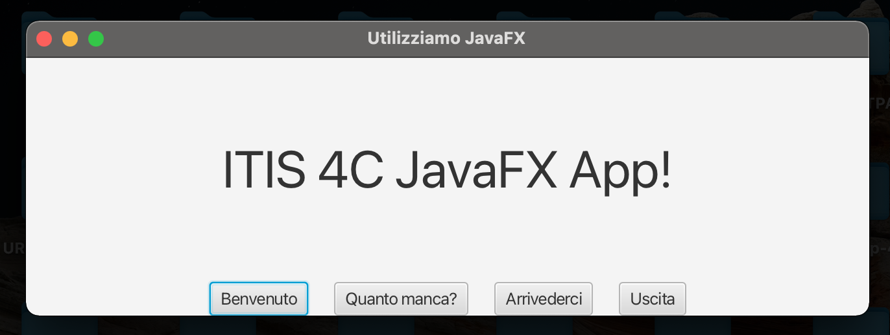
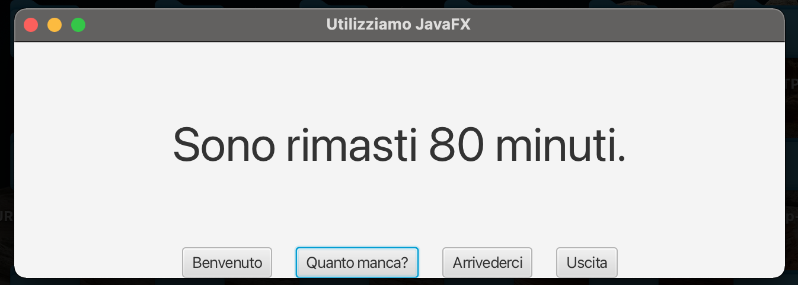

# ITIS4C
Appunti per lezioni


### confronto tra costruttori

a pagina **A86**:

``` java
public class Mensola {
    
  private static final int MAX_NUM_VOLUMI=15;
  private Libro volumi[];
  public Mensola() {
    volumi = new Libro[MAX_NUM_VOLUMI];    
  }
  . . .
}    
```
a pagina **A92** (l'associazione tra le classi *Scaffale* e *Mensola* 
è di tipo **compositivo**):

``` java
public class Scaffale {
    
  private static final int NUM_RIPIANI=5;
  private Mensola ripiani[];
  public Scaffale() {
    int ripiano;  
    ripiani = new Mensola[NUM_RIPIANI];  
    for (ripiano=0; ripiano<NUM_RIPIANI; ripiano++) {
      ripiani[ripiano] = new Mensola();  
    }    
  }
  . . .
}    
```

### attenzione coi costruttori di copia

### stringhe Java e Unicode

``` sh
javac Comprensione.java
java Comprensione
------------------------
Io vivo in Italia (🇮🇹)
------------------------
```

Perchè la lunghezza del tratteggio eccede la stringa se il codice Java è il seguente?

``` java
public class Comprensione {
	public static void main (String[] args) {
		String messaggio = "Io vivo in Italia (🇮🇹)";
		int len = messaggio.length();
		for(int i=0; i<len; i++) System.out.print("-");
		System.out.println("");
		System.out.println(messaggio);
		for(int i=0; i<len; i++) System.out.print("-");
		System.out.println("");		
	}
}
```

### Eccezioni

``` java
import java.time.LocalTime;

public class Ricordami {
    public class OrarioGiaPassato extends Exception {}
    public class OrarioNonValido extends Exception {}
	private int ore;
	private int minuti;
	private void setOre(int hh) {ore = hh;}
	private void setMinuti(int mm) {minuti = mm;}
	public LocalTime getOrario() { return LocalTime.of(ore,minuti);}
	
	public int getMinutiRimasti() 
	           throws OrarioGiaPassato {
		LocalTime adesso = LocalTime.now();
		int valore = adesso.getHour() * 60 + adesso.getMinute();
        if( ( valore ) > ( ore*60 + minuti) )		
		    throw new OrarioGiaPassato();		       
        return ( ore*60 + minuti - valore );
	} 
	
	public Ricordami(int hh, int mm) 
	       throws OrarioNonValido, OrarioGiaPassato {
		if( hh<0 || hh>23 || mm<0 || mm>59)
		    throw new OrarioNonValido();
		LocalTime adesso = LocalTime.now();
        if( ( adesso.getHour() * 60 + adesso.getMinute() ) > (hh*60+mm) )		
		    throw new OrarioGiaPassato();
		ore = hh;
		minuti = mm;           
	}	
	
	public static void main(String[] args) throws OrarioNonValido, OrarioGiaPassato {		
//      Ricordami t0 = new Ricordami( 7, 30);
        Ricordami t1 = new Ricordami(13, 49);
        System.out.println("Sono rimasti " + t1.getMinutiRimasti() + " minuti.");
//      Ricordami t2 = new Ricordami(25, 30);
	}	
}
```

### Interfacce grafiche

``` java
import javafx.application.Application;
import javafx.scene.Scene;
import javafx.stage.Stage;
import javafx.application.Platform;
import javafx.scene.layout.BorderPane;
import javafx.scene.layout.HBox;
import javafx.geometry.Pos;
import javafx.scene.control.Label;
import javafx.scene.control.Button;
import javafx.scene.text.Font;

public class Itis4cJavaFX extends Application {	
  public void start(Stage stage) 
    throws Ricordami.OrarioGiaPassato, Ricordami.OrarioNonValido {
    Label message = new Label("ITIS 4C JavaFX App!");
    message.setFont( new Font(40) );
    Button helloButton = new Button("Benvenuto");
    helloButton.setOnAction( evt -> message.setText("Benvenuti a lezione!") );
    Button timeLeftButton = new Button("Quanto manca?");
    Ricordami acasa = new Ricordami(13, 49);
    timeLeftButton.setOnAction( evt -> {
      try {
        message.setText("Sono rimasti " + acasa.getMinutiRimasti() + " minuti.");
      } catch (Exception e) {
        throw new RuntimeException(e); 
      }
    });
    Button goodbyeButton = new Button("Arrivederci");
    goodbyeButton.setOnAction( evt -> message.setText("Alla prossima lezione!") );
    Button quitButton = new Button("Uscita");
    quitButton.setOnAction( evt -> Platform.exit() );
    HBox buttonBar = new HBox( 20, helloButton, timeLeftButton, goodbyeButton, quitButton );
    buttonBar.setAlignment(Pos.CENTER);
    BorderPane root = new BorderPane();
    root.setCenter(message);
    root.setBottom(buttonBar);
    Scene scene = new Scene(root, 650, 200);
    stage.setScene(scene);
    stage.setTitle("Utilizziamo JavaFX");
    stage.show();    
  } 
  public static void main(String[] args) {
    launch(); 
  }
}
```

### passi di predisposizione, compilazione ed esecuzione

Predisposizione ambiente:

```
cd ITIS4C
export PATH_TO_FX=<<percorso assoluto>>/javafx-sdk-21.0.1/lib
```

Compilazione:

```
javac --module-path $PATH_TO_FX --add-modules javafx.controls,javafx.fxml Itis4cJavaFX.java
```

Esecuzione:

```
java --module-path $PATH_TO_FX --add-modules javafx.controls Itis4cJavaFX
```



